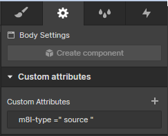

**Idioma**: **[Español](./README.md)** | <span style="color:gray">**Inglés**</span>.

---

&nbsp;

# **Meaningful | Herramientas para Webflow**

En muchas ocasiones, cuando utilizamos Webflow para construir nuestros proyectos, buscamos implementar diferentes funcionalidades basadas en patrones lógicos.

Estas funcionalidades, en ocasiones, pueden llegar a complicarse y, dependiendo del tipo de personalización, pueden requerir utilizar un poco de **"custom code"** dentro de nuestro proyecto. Esto último, puede aumentar considerablemente la dificultad en el desarrollo.

Durante nuestro proceso de aprendizaje, hemos acudido a la comunidad de Webflow (en más de una ocasión), con el objetivo de buscar ayuda para implementar este tipo de funcionalidades. Desarrolladores como "[**Finsweet**](https://finsweet.com/attributes)", han aportado diversas herramientas que facilitan la instalación de estas carácteristicas en los proyectos.

Inspirados en los aportes realizados por otros desarrolladores, desde m8l, hemos buscado aportar a la comunidad de Webflow, con nuestro propio repositorio de "[**Herramientas dinámicas**](#índice)" para Webflow.

En este repositorio, podrás encontrar herramientas para:

-   Insertar CTAs, preconstruidos y personalizados, dentro de elementos de Rich Text.
-   Calcular automáticamente el tiempo de lectura de diferentes fuentes de texto.

&nbsp;

---

&nbsp;

## **Índice**

&nbsp;

| **Versión** | **Nombre**                   | **Docs**                          |
| ----------- | ---------------------------- | --------------------------------- |
| **1.1.0**   | CTAs custom en RichText      | [Link](./tools/customCtas.md)     |
| **1.1.0**   | Tiempo de lectura automático | [Link](./tools/readingTime.md)    |
| **1.0.0**   | Contador de tiempo regresivo | [Link](./tools/countdownTimer.md) |
| **1.0.0**   | Bloques de texto para copiar | [Link](./tools/copyBlocks.md)     |

&nbsp;

---

&nbsp;

## **Aspectos Generales**

&nbsp;

Todas nuestras herramientas, están construidas bajo el mismo principio: "**_*Facilitar la implementación y configuración de funcionalidades complejas*_**". Es por ello que coincidimos con otros desarrolladores, en la utilización de los "**_*atributos*_**" para la configuración de nuestras herramientas. Como referencia, los atributos son los campos de personalización que pueden encontrar al final del panel de configuración de un elemento en específico, dentro de Webflow

&nbsp;



&nbsp;

Los atributos que solemos utilizar para la configuración de nuestras herramientas, tienen el prefijo m8l al comienzo de cada keyword. Así como también tienen asignado un valor específico para la configuración de la funcionalidad a implementar.

&nbsp;

Todas nuestras funcionalidades, se basan en la configuración de la variable "**_*m8lConfig*_**". Puesto que la misma se encarga de configurar las funcionalidades de m8l que se están utilizando en el proyecto. Dicha variable, posee la siguiente forma:

&nbsp;

```javascript
window.m8lConfig = {
    customCtas: {
        list: "cta-1,cta-2,cta-5",
        source: "source href",
    },
    readingTime: {
        calculationType: "average",
        wordsPerMinute: 200,
    },
};
```

&nbsp;

Más adelante, explicaremos cómo configurar dicha variable para cada proyecto que deseemos realizar.

&nbsp;

---

&nbsp;

[m8l](www.m8l.com "About us") | Tech Team
