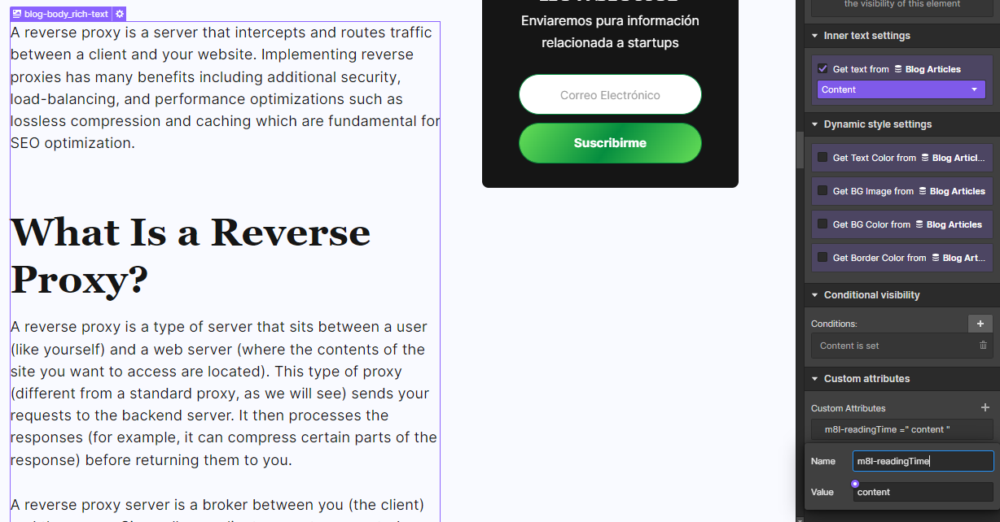
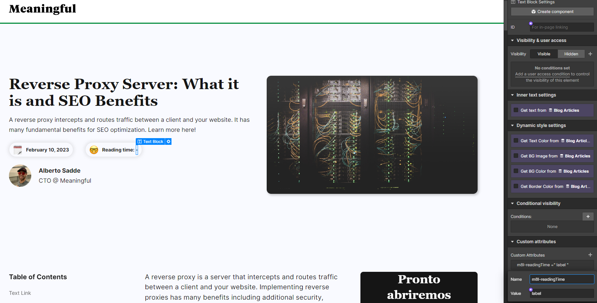

# **Meaningful | Tiempo de lectura automático**

Usualmente los artículos de blog en internet, poseen un indicador del tiempo de lectura para que los usuarios puedan identificar el tiempo de consumo estimado al momento de considerar leer un determinado contenido.

En muchas ocasiones, los Blog que se encuentran construidos dentro de Webflow, incorporan un campo de "CMS" en el que, el administrador del blog, declara el tiempo de lectura estimado del artículo. Dicha práctica puede ser muy manual y un tanto tediosa de realizar. Es por ello que desde m8l, desarrollamos una funcionalidad para calcular el tiempo de lectura de nuestros artículos del blog, de forma automática.

&nbsp;

---

&nbsp;

## **Primeros pasos**

&nbsp;

Para instalar la funcionalidad de tiempo de lectura dentro de tu página de artículos del blog, sigue los pasos que te describimos a continuación:

&nbsp;


&nbsp;

### **Paso 1:** _*Agregar atributos*_.

Para que esta funcionalidad, se encuentre correctamente configurada, es necesario identificar los siguientes elementos dentro de nuestro proyecto:

&nbsp;

#### **Cuerpo del artículo**:

Corresponde a las fuentes de información que contendrán todo el contenido de nuestro artículo. Es todo el contenido sobre el cual queremos estimar el tiempo total de lectura.

Para la identificación de estos elementos, se utilizará el atributo:

```
 m8l-readingTime = 'content'
```

El mismo se deberá colocar a los elementos que queremos vincular en el cálculo del tiempo de lectura, tal como se muestra en la imagen a continuación:



&nbsp;

#### **Indicadores**:

Corresponden a los bloques de texto que queremos utilizar como indicador de tiempo de lectura en nuestros artículos del blog.

Para la identificación de estos elementos, se utilizará el atributo:

```
 m8l-readingTime = 'label'
```

El mismo se deberá colocar a los elementos con los que queremos mostrar el tiempo de lectura, tal como se muestra en la imagen a continuación:



&nbsp;

**PD:** Podemos añadir más de un indicador y más de una fuente de contenido. Para ello, solo debemos asignar los atributos tal como lo hicimos con los primeros elementos. Los mismos funcionarán bajo las siguientes premisas:

-   Todos los elementos de contenido vinculados contarán para el tiempo de lectura total.
-   Todos los elementos de indicador vinculados, mostrarán el mismo tiempo de lectura total.

&nbsp;

### **Paso 2:** _*Variable de configuración de m8l*_.

A continuación, procederemos con la implementación de variable de configuración dentro de nuestro proyecto. Para ello deberemos copiar y pegar el siguiente bloque de código dentro de nuestra etiqueta `<head>`:

```html
<!-- [Start: m8l Config] -->
<script>
    var m8lConfig = {
        readingTime: {},
    };
</script>
<!-- [End: m8l Config] -->
```

&nbsp;

### **Paso 3:** _*Instalación*_.

A continuación, procederemos con la instalación del script de funcionalidad. Para ello deberemos copiar y pegar el siguiente bloque de código dentro de nuestra etiqueta `<head>`:

```html
<!-- [Start: Reading time Script] -->
<script
    defer
    src="https://cdn.jsdelivr.net/gh/meaningfulteam/m8l-webflow-tools@main/tools/ReadingTime/m8l-readingTime.js"
></script>
<!-- [End: Reading time Script] -->
```

De esta forma, nuestro script de tiempo de lectura habrá funcionado correctamente y una vez publicado el proyecto, se verá en funcionamiento el script dentro de nuestro sitio web.

&nbsp;

---

&nbsp;

## **Configuraciones opcionales**

Este script posee 2 configuraciones opcionales que podremos añadir a nuestro proyecto si lo deseamos. Para ello solo debemos añadir los parámetros necesarios dentro de nuestra variable de configuración `m8lConfig`.

```html
<!-- [Start: m8l Config] -->
<script>
    var m8lConfig = {
        readingTime: {
            // Aquí se ponen los parámetros opcionales
            calculationType: "average",
            wordsPerMinute: 250,
        },
    };
</script>
<!-- [End: m8l Config] -->
```

&nbsp;

### **Personalización de tipo de cálculo**

Este parámetro permite personalizar el cálculo del tiempo de lectura, basandose en el parámetro de "**_*calculationType*_**". El valor que se debe introducir en este campo debe ser de tipo "**String**" (texto entre comillas "" o ''). Ejemplo:

```html
<!-- [Start: m8l Config] -->
<script>
    var m8lConfig = {
        readingTime: {
            calculationType: "average",
        },
    };
</script>
<!-- [End: m8l Config] -->
```

Para este parámetro existen 4 diferentes tipos de cálculo:

-   **cumulative**: cuyo método consiste en la suma de todos los tiempos de lectura de las fuentes señaladas en la página.
-   **longerTime**: cuyo método consiste en la selección del tiempo de lectura más largo, entre las diferentes fuentes identificadas.
-   **lessTime**: cuyo método consiste en la selección del tiempo de lectura más corto, entre las diferentes fuentes identificadas.
-   **average**: cuyo método consiste en el cálculo del tiempo de lectura promedio, entre las diferentes fuentes identificadas.

Es importante acotar, que si no se personaliza este campo, el valor utilizado por defecto será el de "**cumulative**".

&nbsp;

### **Personalización de la velocidad de lectura**

Este parámetro permite personalizar el tipo de cálculo del tiempo de lectura, basandose en el parámetro de "**_*wordsPerMinute*_**". El valor que se debe introducir en este campo debe ser de tipo "**Number**". Ejemplo:

```html
<!-- [Start: m8l Config] -->
<script>
    var m8lConfig = {
        readingTime: {
            wordsPerMinute: 250,
        },
    };
</script>
<!-- [End: m8l Config] -->
```

Es importante acotar, que si no se personaliza este campo, el valor utilizado por defecto será de "**200**" palábras por minuto (valor estandar según diferentes estudios).

&nbsp;

---

&nbsp;

## **Errores**

Es posible que durante la configuración, puedan saltar diferentes errores en la consola, si no estamos atentos a cada uno de los pasos realizados. Es por ello que dejamos por acá una pequeña guía para saber identificar el origen del problema según el mensaje de error:

&nbsp;

| Mensaje de error                                                                     | Causa                                                                                                                                                                                                            |
| ------------------------------------------------------------------------------------ | ---------------------------------------------------------------------------------------------------------------------------------------------------------------------------------------------------------------- |
| Error trying to calculate reading time. Error message → Unrecognized calculationType | Ocurre cuando configuramos mal el parámetro "calculationType" y colocamos un valor no contemplado entre los 4 valores posibles. Recuerda escribir todo en minúsculas.                                            |
| Implementation Error: Reading Time Script                                            | Ocurre cuando el script de implementación del tiempo de lectura automático, no fue configurado correctamente, debido a que los atributos asignados a los elementos no fueron los correctos o poseen algún error. |
