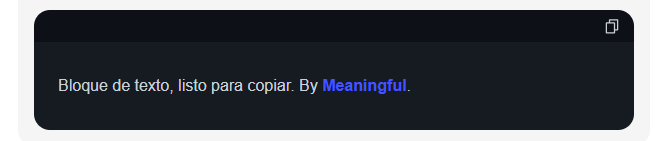
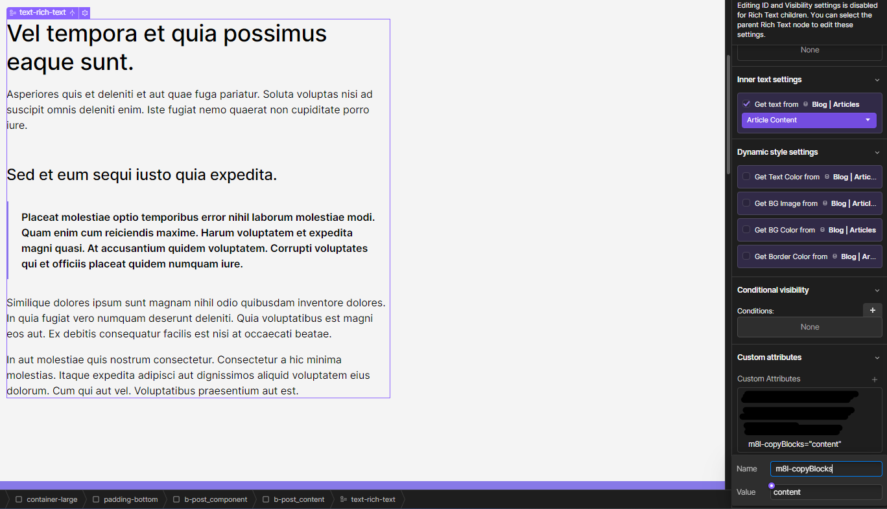
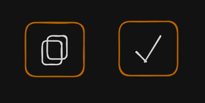
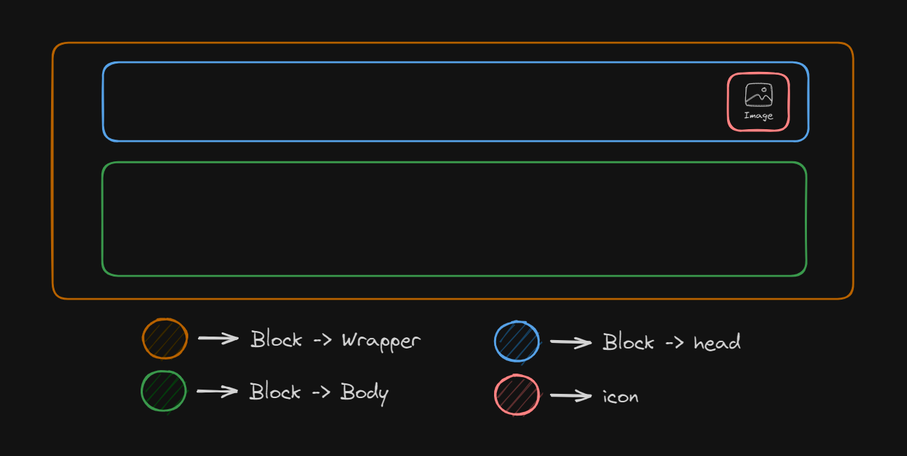
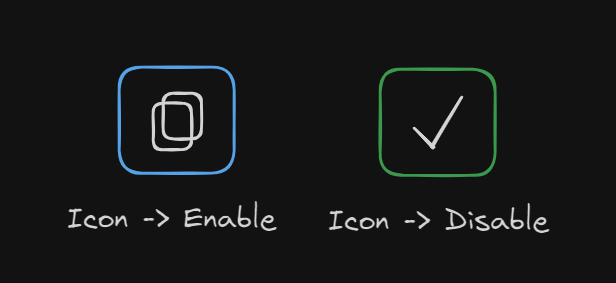

# **Meaningful | Bloques de texto para copiar**

En ocasiones, es necesario que el lector pueda copiar con mayor facilidad contenido del artículo para ser utilizado con un propósito específico. En esta documentación, verás como implementar una herramienta desarrollada por el equipo de Meaningful, que permite a los usuarios crear bloques de texto predefinidos con contenido relevante, atractivo y listo para ser copiado por los lectores.

&nbsp;

---

&nbsp;

## **Primeros pasos**

&nbsp;

Para instalar la funcionalidad de bloques de texto dentro de tu página en tu proyecto de webflow, sigue los pasos que te describimos a continuación:

&nbsp;



&nbsp;

### **Paso 1:** _*Agregar atributos*_.

Para que esta funcionalidad, se encuentre correctamente configurada, es necesario identificar el siguiente elemento dentro de nuestro proyecto:

&nbsp;

#### **Contenidos**:

Ya que la intención es poder agregar estos bloques de texto, dentro del cuerpo de elementos de RichText (aunque no de forma exclusiva), se deben identificar todos los elementos donde se desea añadir un bloque de texto. La forma de identificarlo, será añadiendo el siguiente atributo a cada elemento de interés.

```
 m8l-copyBlocks="content"
```

En la siguiente imágen se muestra cómo añadir dicho atributo al bloque de contenido.



&nbsp;

### **Paso 2:** _*Variable de configuración de m8l*_.

A continuación, procederemos con la implementación de variable de configuración dentro de nuestro proyecto. Para ello deberemos copiar y pegar el siguiente bloque de código dentro de nuestra etiqueta `<head>`:

```html
<!-- [Start: m8l Config] -->
<script>
    window.m8lConfig = {
        copyBlocks: {},
    };
</script>
<!-- [End: m8l Config] -->
```

Donde el valor "`copyBlocks`" indicará a nuestra herramienta que dicha funcionalidad está activada y por ende, es posible utilizarla en la página actual.

Dentro de las llaves ("`{}`"), se agregará la configuración personalizada. Esto último lo explicaremos [más adelante](#configuraciones-opcionales) en esta documentación.

&nbsp;

### **Paso 3:** _*Instalación*_.

A continuación, procederemos con la instalación del script de funcionalidad. Para ello debemos copiar y pegar el siguiente bloque de código dentro de nuestra etiqueta `<body>`:

```html
<!-- [Start: Copy blocks Script] -->
<script
    type="module"
    src="https://cdn.jsdelivr.net/gh/meaningfulteam/m8l-webflow-tools@v1.2.0/tools/copyBlocks/m8l-copyBlocks.js"
></script>
<!-- [End: Copy blocks Script] -->
```

De esta forma, nuestro script de bloques de texto para copiar estará funcionando correctamente y una vez publicado el proyecto, se verán los resultados del script dentro de nuestro sitio web.

&nbsp;

---

&nbsp;

## **Funcionamiento**

&nbsp;

Para garantizar que nuestro script sepa cómo ubicar los bloques de texto de la forma adecuada, debemos envolver nuestro fragmento de texto, dentro de las siguientes palabras claves: `%%cb%%"` y `"%%cb%%`.

Por otro lado, debemos garantizar que dicha indicación estamos haciendola dentro de una nueva línea de texto. Por ejemplo:

```Text
We work with venture-backed companies, great teams and ambitious entrepreneurs. Since we've walked in those shoes, we can empathize more with their day-to-day situations and challenges.

%%cb%%" Quiero que el usuario, pueda copiar este texto. "%%cb%%

Collaboratively deploy intuitive partnerships whereas customized e-markets. Energistically maintain performance based strategic theme areas whereas just in time methodologies.
```

En el ejemplo anterior, nos estamos asegurando de incrustar el bloque de texto justo entre los parrafos. Para ello es necesario mencionar que la combinación de carácteres: `%%cb%%"` y `"%%cb%%`, no posee espacios al antes o después de haber sido incrustada.

Al publicar el proyecto, podremos observar el resultado de nuestra configuración.

En el caso de querer agregar más de un bloque de texto, simplemente debemos repetir el paso anterior, tantas veces como bloques de texto querramos añadir. Por ejemplo:

```Text
We work with venture-backed companies, great teams and ambitious entrepreneurs. Since we've walked in those shoes, we can empathize more with their day-to-day situations and challenges.

%%cb%%" Quiero que el usuario, pueda copiar el texto 1. "%%cb%%

Collaboratively deploy intuitive partnerships whereas customized e-markets. Energistically maintain performance based strategic theme areas whereas just in time methodologies.

%%cb%%" Quiero que el usuario, pueda copiar el texto 2. "%%cb%%

```

En este último ejemplo, estaremos agregando 2 bloques de texto diferentes, dentro del mismo contenido.

&nbsp;

---

&nbsp;

## **Configuraciones opcionales**

Este script posee múltiples configuraciones adicionales que podremos añadir a nuestro proyecto si lo deseamos. Para ello solo debemos añadir los parámetros necesarios dentro de nuestra variable de configuración `m8lConfig`.

```html
<!-- [Start: m8l Config] -->
<script>
    window.m8lConfig = {
        copyBlocks: {
            // ↓ Aquí se ponen los parámetros opcionales ↓
            customBrackets: "%%m8l%%",
            assets: {
                success: "https://asset-1.svg",
                copy: "https://asset-2.png",
            },
            styles: {
                icon: {
                    enable: "post-body_box_icon-enable",
                    disable: "post-body_box_icon-disable",
                },
                block: {
                    head: "post-body_box_block-head",
                    body: "post-body_box_block-body",
                    wrapper: "post-body_box_block-wrapper",
                },
            },
            // ↑ Aquí se ponen los parámetros opcionales ↑
        },
    };
</script>
<!-- [End: m8l Config] -->
```

&nbsp;

### **Personalización de las llaves de identificación**

Es posible, que la combinación de carácteres reservados `%%cb%%`, no sea la más adecuada para nuestro proyecto. Ya que interfiere con el contenido que estamos desarrollando o ya está siendo utilizada por una herramienta diferente.

Para evitar este conflicto, es posible configurar nuestra herramienta para aceptar la combinación de símbolos de nuestra preferencia. Para ello, solo debemos agregar la llave "`customBrackets`" de la siguiente forma:

```html
<!-- [Start: m8l Config] -->
<script>
    window.m8lConfig = {
        copyBlocks: {
            customBrackets: "{ AQUÍ VAN LAS LLAVES PERSONALIZADAS }",
        },
    };
</script>
<!-- [End: m8l Config] -->
```

Donde el texto "`{ AQUÍ VAN LAS LLAVES PERSONALIZADAS }`" debe ser sustituido con la combinación de letras de su preferencia. Por ejemplo:

```html
<!-- [Start: m8l Config] -->
<script>
    window.m8lConfig = {
        copyBlocks: {
            customBrackets: "@@m8l@@",
        },
    };
</script>
<!-- [End: m8l Config] -->
```

Se recomienda que la combinación sea única y poco utilizada dentro del contenido de su página web. Así podrá evitar fallos en el funcionamiento de la herramienta. Adicionalmente, se recuerda que a pesar de haber sustituido las llaves, aún es necesario agregar las comillas ("), entre ambos brackets.

Tomando en cuenta lo anteriormente mencionado y continuando con el último ejemplo, la forma de implementación del mismo, sería:

```Text
We work with venture-backed companies, great teams and ambitious entrepreneurs. Since we've walked in those shoes, we can empathize more with their day-to-day situations and challenges.

@@m8l@@" Quiero que el usuario, pueda copiar este texto. "@@m8l@@

Collaboratively deploy intuitive partnerships whereas customized e-markets. Energistically maintain performance based strategic theme areas whereas just in time methodologies.
```

&nbsp;

### **Personalización de iconos**

Es posible que querramos adaptar nuestro bloque de texto al estilo utilizado dentro de nuestro proyecto. Para ello, es posible sustituir los íconos utilizados para el botón de copiado.



Para lograr esta modificación, debemos añadir la llave "`assets`" de la siguiente forma:

```html
<!-- [Start: m8l Config] -->
<script>
    window.m8lConfig = {
        copyBlocks: {
            assets: {
                success: "{ URL de asset de success }",
                copy: "{ URL de asset de copiar }",
            },
        },
    };
</script>
<!-- [End: m8l Config] -->
```

Donde los valores de "`{ URL de asset de success }`" y "`{ URL de asset de copiar }`" deben ser sustituidos por los URL de los assets que se desean utilizar para cada una de las funciones. Siendo "copy" el ícono que se muestra de forma permanente y "success" el icono que se muestra una vez el usuario interactuó con el botón. Por ejemplo:

```html
<!-- [Start: m8l Config] -->
<script>
    window.m8lConfig = {
        copyBlocks: {
            assets: {
                success: "https://webflow/asset-1.png",
                copy: "https://webflow/asset-1.webp",
            },
        },
    };
</script>
<!-- [End: m8l Config] -->
```

Es importante tomar en cuenta que el formato del asset puede ser cualquiera, siempre y cuando sea compatible con el elemento "imagen" de Webflow. Adicionalmente, es importante aclarar que esta herramienta solo acepta modificación en ambos assets. Es decir, no es posible modificar solo uno de ellos, ya que al agregar la llave: "`assets`", se le está indicando a nuestra herramienta que ambos assets serán personalizados.

&nbsp;

### **Personalización de estilos**

Esta personalización, es quizás la más "compleja" de implementar, ya que la misma requiere ser cuidadoso al momento de configurarla. Sin embargo, la forma de hacerlo no implica un nivel elevado de conocimientos previos.

Para poder personalizar los estilos, es necesario agregar la llave: "`styles`". Para ello debemos hacerlo de la siguiente forma:

```html
<!-- [Start: m8l Config] -->
<script>
    window.m8lConfig = {
        copyBlocks: {
            styles: {
                icon: {
                    enable: "{ Clase de estilo }",
                    disable: "{ Clase de estilo }",
                },
                block: {
                    head: "{ Clase de estilo }",
                    body: "{ Clase de estilo }",
                    wrapper: "{ Clase de estilo }",
                },
            },
        },
    };
</script>
<!-- [End: m8l Config] -->
```

Donde el texto "`{ Clase de estilo }`" debe ser sustituido por el nombre de la clase de Webflow vinculada a ese elemento. Es importante aclarar que la clase de Webflow escrita, debe estar en minúscula y con guiones ("-") en lugar de espacios (a menos que se deseen añadir combo clases, ya que en dicho caso los espacios indicarán que se trata de una clase diferente).

Para entender la estructura propuesta para este elemento, ayuda tener como referencia la siguiente imágen:



Donde el los elementos dentro de la llave "`block`" corresponden a la estructura del bloque y los elementos dentro de la clase "`icon`" corresponden a los estilos del botón en cada una de sus fases.

En el block, podemos encontrar:

-   **_head_**: Corresponde al `div` envoltorio del encabezado del bloque.
-   **_body_**: Corresponde al `div` envoltorio del texto que el usuario quiere copiar.
-   **_wrapper_**: Corresponde al `div` envoltorio de nuestro bloque de texto para copiar. Es decir, al elemento completo que estamos incrustando.

Por otro lado, en la llave "icon", podemos encontrar:

-   **_enable_**: Corresponde a la clase que tiene el `div` envoltorio de nuestro icono. Esta clase adicionalmente indica al usuario que el botón se encuentra disponible para copiar.
-   **_disable_**: Corresponde a la clase que tiene el `div` envoltorio de nuestro icono. Esta clase adicionalmente indica al usuario que el botón ya copió el texto asociado y pronto se reiniciará.

Como ven, ambas clases de iconos interactuan sobre el mismo elemento. La diferencia es que esta configuración permite ajustar ambos estados del botón.



&nbsp;

---

&nbsp;

## **Errores**

Es posible que durante la configuración, puedan saltar diferentes errores en la consola, si no estamos atentos a cada uno de los pasos realizados. Es por ello que dejamos por acá una pequeña guía para saber identificar el origen del problema según el mensaje de error:

&nbsp;

| Mensaje de error                         | Causa                                                                                                                                                                                                                                                                                                                                                           |
| ---------------------------------------- | --------------------------------------------------------------------------------------------------------------------------------------------------------------------------------------------------------------------------------------------------------------------------------------------------------------------------------------------------------------- |
| Fetch default styles                     | Ocurre cuando ocurrió un fallo al momento de solicitar los estilos default. Este error puede ser ocasionado a raíz de una falla de conexión de internet.                                                                                                                                                                                                        |
| Implementation Error: Copy blocks Script | Ocurre cuando el script de implementación de la funcionalidad de bloques para copiar, no fue configurado correctamente, debido a que los atributos asignados a los elementos no fueron los correctos o poseen algún error. Asegurate de pegar el script en la etiqueta `<body>` mientras que la variable de configuración se encuentre en la etiqueta: `<head>` |
| Configuration error.                     | Este error se debe a una mala configuración de la propiedad de `m8l`. Se recomienda revisar esta guía y comparar para evitar fallos al momento de la configuración de la misma                                                                                                                                                                                  |
| No valid assets detected                 | Este error ocurre cuando el usuario agregó la llave "`assets`" pero no especificó alguno de los dos assets requeridos.                                                                                                                                                                                                                                          |
