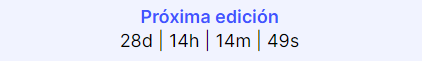
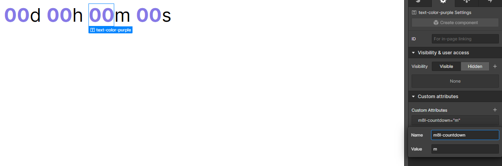
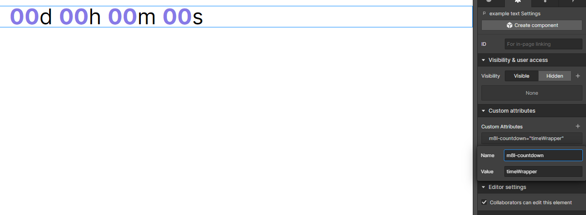
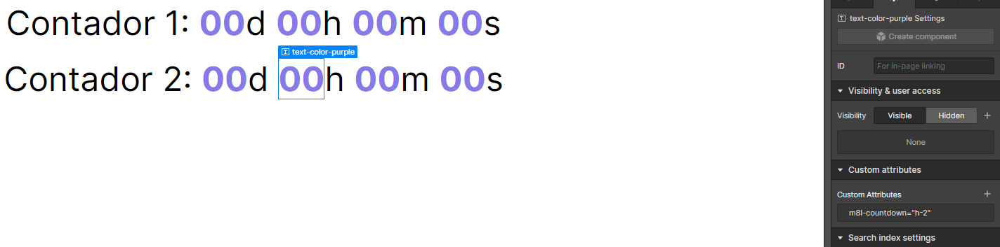

# **Meaningful | Contador de tiempo regresivo**

Los contadores de tiempo regresivo son una solución efectiva para crear un sentido de urgencia y resaltar eventos, ofertas o promociones próximas. En esta guía rápida, te mostraremos cómo instalar y utilizar un script para añadir contadores de tiempo regresivo en tus proyectos de Webflow de forma sencilla.

&nbsp;

---

&nbsp;

## **Primeros pasos**

&nbsp;

Para instalar la funcionalidad de contador de tiempo regresivo dentro de tu página de tu proyecto de webflow, sigue los pasos que te describimos a continuación:

&nbsp;



&nbsp;

### **Paso 1:** _*Agregar atributos*_.

Para que esta funcionalidad, se encuentre correctamente configurada, es necesario identificar los siguientes elementos dentro de nuestro proyecto:

&nbsp;

#### **Contadores**:

Corresponden a los diferentes textos que irán cambiando de valor para indicar el tiempo restante hasta la fecha objetivo. Los indicadores se buscan asignar a elementos de tipo "texto", es decir: Headings, Párrafos, Textblocks, LinkText, etc. Existen 4 tipos de contadores:

-   **Días:** Se identifica con el atributo:

```
m8l-countdown='d'
```

-   **Horas:** Se identifica con el atributo:

```
m8l-countdown='h'
```

-   **Minutos:** Se identifica con el atributo:

```
m8l-countdown='m'
```

-   **Segundos:** Se identifica con el atributo:

```
m8l-countdown='s'
```

Estos se deberán colocar, de la siguiente manera, a los elementos que queremos utilizar como indicadores. Utilizando la funcionalidad de atributos que Webflow ofrece.



&nbsp;

#### **Wrapper**:

Corresponde al elemento que envuelve a nuestro contador. Debido a que, en la mayoría de los casos, queremos que, al llegar a cero, se sustituya el mensaje en pantalla por un mensaje específico. Para ello utilizaremos el siguiente atributo:

```
 m8l-countdown = 'timeWrapper'
```

El mismo se deberá colocar, de la siguiente manera, al elemento padre de nuestro contador de tiempo regresivo:



&nbsp;

### **Paso 2:** _*Variable de configuración de m8l*_.

A continuación, procederemos con la implementación de variable de configuración dentro de nuestro proyecto. Para ello deberemos copiar y pegar el siguiente bloque de código dentro de nuestra etiqueta `<head>`:

```html
<!-- [Start: m8l Config] -->
<script>
    window.m8lConfig = {
        countdown: {
            data: [{ date: "Goal date" }],
            defaultMessage: "Its Done!",
        },
    };
</script>
<!-- [End: m8l Config] -->
```

Donde el valor "`Goal date`" debe ser sustituido por la fecha objetivo con la cual se desea vincular el contador. Esta fecha debe estar en formato: "`Nov 1, 2023 12:00:00`".

Por otro lado, el texto "`Its Done!`" puede ser sustituído por cualquier otro mensaje que querramos, sea puesto en lugar de nuestro contador, una vez el tiempo llegue a cero.
&nbsp;

### **Paso 3:** _*Instalación*_.

A continuación, procederemos con la instalación del script de funcionalidad. Para ello debemos copiar y pegar el siguiente bloque de código dentro de nuestra etiqueta `<body>`:

```html
<!-- [Start: Countdown Script] -->
<script type="module" src="https://cdn.jsdelivr.net/gh/meaningfulteam/m8l-webflow-tools@v1.1.1/tools/countdown/m8l-countdown.js"></script>
<!-- [End: Countdown Script] -->
```

De esta forma, nuestro script de contador de tiempo regresivo estará funcionando correctamente y una vez publicado el proyecto, se verán los resultados del script dentro de nuestro sitio web.

&nbsp;

---

&nbsp;

## **Configuraciones opcionales**

Este script posee múltiples configuraciones adicionales que podremos añadir a nuestro proyecto si lo deseamos. Para ello solo debemos añadir los parámetros necesarios dentro de nuestra variable de configuración `m8lConfig`.

```html
<!-- [Start: m8l Config] -->
<script>
    window.m8lConfig = {
        countdown: {
            data: [{ date: "Goal date" }],
            // ↓ Aquí se ponen los parámetros opcionales ↓
            defaultMessage: "Its Done!",
            callback: ({ date, suffix, config })=>{...}
            // ↑ Aquí se ponen los parámetros opcionales ↑
        },
    };
</script>
<!-- [End: m8l Config] -->
```

&nbsp;

### **Personalización de la acción de finalización del contador**

Si bien, anteriormente mencionamos que la acción (por defecto) que ocurre en nuestro contador al llegar a cero, es un simple cambio de texto. Es posible personalizar esta acción utilizando el parámetro "`callback`". Este parámetro está definido como una función, cuyo valor es 100% personalizado por el usuario. Veamos el siguiente ejemplo:

```html
<!-- [Start: m8l Config] -->
<script>
    window.m8lConfig = {
        countdown: {
            data: [{ date: "Goal date" }],
            defaultMessage: "Its Done!",
            callback: ({ date, suffix, config }) => {
                doSomething({ date, suffix, config });
            },
        },
    };
</script>
<!-- [End: m8l Config] -->
```

En este ejemplo, la acción a ejecutarse al llegar a cero, es ejecutar la función "`doSomething`".

Es necesario acotar que el parámetro "`callback`" recibe como entrada 3 parámetros definidos, los cuales son "`date`", "`suffix`" y "`config`", los cuales corresponden a:

-   `date` = fecha objetivo.
-   `suffix` = terminación del atributo: " ","`-1`", "`-2`", etc.
-   `config` = etiquetas configuradas para esa fecha: `["d", "h", "m", "s"]`

Más adelante profundizaremos un poco en el significado de cada uno y en cómo ampliar la personalización del script.

&nbsp;

### **Personalización de los contadores**

Este parámetro está vinculado diréctamente con la fecha configurada, y nos permite indicar qué valores queremos mostrar en pantalla (días, horas, minutos y segundos). Esto debido a que no todo el tiempo podemos tener interés en mostrar los segundos, minutos u horas.

La forma de configurar estos valores es con el parámetro "`config`" dentro del objeto de fecha. Por ejemplo:

```html
<!-- [Start: m8l Config] -->
<script>
    window.m8lConfig = {
        countdown: {
            data: [{ date: "Goal date", config: ["d", "h", "m"] }],
            defaultMessage: "Its Done!",
        },
    };
</script>
<!-- [End: m8l Config] -->
```

En este ejemplo estamos configurando en el script que solo nos interesa mostrar los cálculos de "días" (d), "horas" (h) y "minutos" (m). Es importante señalar, que los parámetros configurados corresponden a los atributos añadidos. Es decir, por cada parámetro configurado, existe su correspondiente contador marcado con atributo. En el caso de no incluir algún parámetro, es posible prescindir de marcar dicho atributo en el proyecto de Webflow.

**PD:** Por defecto, si no indicamos nada en el parámetro "`config`", se asumirá que la configuración es "`["d", "h", "m", "s"]`", y por ende, tendremos que añadir los atributos correspondientes a cada parte del contador.

&nbsp;

### **Personalización de mensaje de finalización**

Este mensaje se puede personalizar editando el parámetro: "`defaultMessage`" dentro de nuestro script de configuración. Es necesario acotar, que en el caso de no incluir dicho parámetro en la configuración, el valor asignado al mismo será un texto vació (" "). En dicho caso, el contador solo desaparecería y nuestra variable de configuración, luciría de la siguiente forma:

```html
<!-- [Start: m8l Config] -->
<script>
    window.m8lConfig = {
        countdown: {
            data: [{ date: "Goal date" }],
        },
    };
</script>
<!-- [End: m8l Config] -->
```

&nbsp;

### **Añadir múltiples contadores en pantalla**

Es posible que exista el caso donde necesitamos tener más de un contador de tiempo regresivo en pantalla. Y en esos casos, es posible que la fecha objetivo no sea igual para cada contador. Para ello, tenemos este script resuelve este problema de la siguiente manera:

-   **_Paso 1:_** Añadir los atributos correspondientes a cada elemento del contador, identificando con un "-n" el contador al que pertenece. Ejemplo:



De acuerdo a lo representado en la siguiente tabla, donde "n" corresponde al número de contadores deseados.

| **m8l-countdown** | Contador 1    | Contador 2    | ... | Contador n    |
| ----------------- | ------------- | ------------- | --- | ------------- |
| `días`            | d-1           | d-2           | ... | d-n           |
| `horas`           | h-1           | h-2           | ... | h-n           |
| `minutos`         | m-1           | m-2           | ... | m-n           |
| `segundos`        | s-1           | s-2           | ... | s-n           |
| `timeWrapper`     | timeWrapper-1 | timeWrapper-2 | ... | timeWrapper-n |

En el ejemplo anterior, vimos que solo habían 2 contadores y por ende, solo se llega hasta el valor "2" en los atributos.

&nbsp;

-   **_Paso 2:_** Configurar las fechas objetivo en la variable de configuración de m8l. Ejemplo:

```html
<!-- [Start: m8l Config] -->
<script>
    window.m8lConfig = {
        countdown: {
            data: [
                { date: "Goal date 1" },
                { date: "Goal date 2" },
                { date: "Goal date 3" },
                { date: "Goal date 4" },
                { date: "Goal date 5" },
            ],
        },
    };
</script>
<!-- [End: m8l Config] -->
```

En este ejemplo, cada "`Goal date`" corresponde a un contador específico. Donde la primera fecha de la lista corresponderá al contador "**1**", la segunda al contador "**2**", y así sucesivamente.

En esta etapa es necesario aclarar un par de aspectos adicionales:

-   El parámetro `callback` es el mismo para todas las fechas, por ende se recomienda aprovechar los parámetros de entrada de la función "callback" ("`date`", "`suffix`" y "`config`") para distinguir el elemento al que pertenece la fecha de finalización.
-   En el caso de personalizar el parámetro `defaultMessage`, el mismo será aplicado para todas las fechas. A diferencia del parámetro anterior, este no posee ningún tipo de personalización más allá del copy. Por ende, se recomienda utilizar el parámetro `callback` en el caso de que se desee aumentar el nivel de personalización.
-   Es posible ajustar el parámetro "`config`" para cada fecha, de forma independiente. Para ello solo es necesario agregarlo al objeto como de la forma en la que fue mostrado anteriormente.

A continuación, mostramos un ejemplo de una variable de configuración aplicada de forma adecuada:

```html
<!-- [Start: m8l Config] -->
<script>
    window.m8lConfig = {
        countdown: {
            data: [
                {
                    date: "Nov 1, 2023 12:00:00",
                    config: ["d", "h", "m", "s"],
                },
                {
                    date: "Nov 2, 2023 12:00:00",
                    config: ["h", "m"],
                },
                {
                    date: "Nov 3, 2022 12:00:00",
                    config: ["h", "m", "s"],
                },
                {
                    date: "Nov 3, 2022 12:00:00",
                },
            ],
            defaultMessage: "Its Over!",
            callback: ({ date, suffix, config }) => {
                console.log("Its works!!");
            },
        },
    };
</script>
<!-- [End: m8l Config] -->
```

En el ejemplo anterior, se ilustran las diferentes formas de añadir fechas y de configurar cada una. Así como también se muestra la forma de añadir los parámetros opcionales de mensaje y funcionalidad.

&nbsp;

---

&nbsp;

## **Errores**

Es posible que durante la configuración, puedan saltar diferentes errores en la consola, si no estamos atentos a cada uno de los pasos realizados. Es por ello que dejamos por acá una pequeña guía para saber identificar el origen del problema según el mensaje de error:

&nbsp;

| Mensaje de error                                                                              | Causa                                                                                                                                                                                                                                                                                                                                                      |
| --------------------------------------------------------------------------------------------- | ---------------------------------------------------------------------------------------------------------------------------------------------------------------------------------------------------------------------------------------------------------------------------------------------------------------------------------------------------------- |
| Configuration error in date '{date "XXXX", index: "XX"}' because: "Error: Elements not found" | Ocurre cuando configuramos de forma incorrecta el parámetro "config" dentro de la fecha a la cual queremos asignar un contador. Adicionalmente, este error tambiénj puede ocurrir por una mala implementación de atributos a los diferentes elementos asignados. Recuerda que si hay un solo contador en pantalla, no es necesario asignar el sufijo "-n". |
| Implementation Error: countdown Script                                                        | Ocurre cuando el script de implementación del countdown, no fue configurado correctamente, debido a que los atributos asignados a los elementos no fueron los correctos o poseen algún error. Asegurate de pegar el script en la etiqueta `<body>` mientras que la variable de configuración se encuentre en la etiqueta: `<head>`                         |
