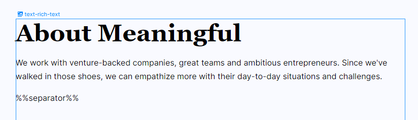
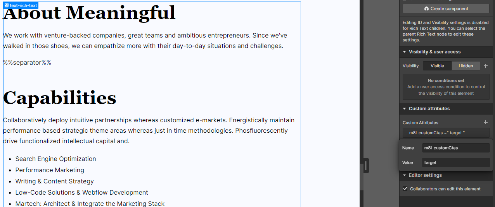
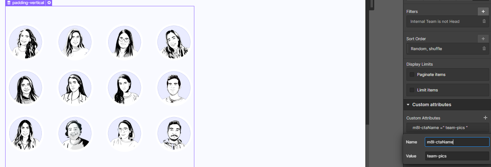

# **Meaningful | CTAs personalizados dentro de elementos de Rich Text**

Usualmente los artículos de blog en internet, poseen una gran diversidad de CTAs ubicados estratégicamente dentro del cuerpo de nuestro artículo. Muchas veces, cuando construimos en Webflow, queremos utilizar una diversidad de integraciones en nuestro proyecto o, simplemente, queremos optimizar la cantidad de campos en el CMS de nuestro blog.

Es ahí donde nace la necesidad de encontrar una manera fácil y rápida de poder inyectar secciones preconstruidas en la ubicación seleccionada de nuestro artículo de blog. Es por ello que desde m8l, desarrollamos una funcionalidad para lograr esta funcionalidad.

&nbsp;

---

&nbsp;

## **Primeros pasos**

&nbsp;

Para instalar la funcionalidad de CTAs personalizados dentro de tu página de artículos del blog, sigue los pasos que te describimos a continuación:

&nbsp;




&nbsp;

### **Paso 1:** _*Agregar atributos*_.

Para que esta funcionalidad, se encuentre correctamente configurada, es necesario identificar los siguientes elementos dentro de nuestro proyecto:

&nbsp;

#### **Bloques de Rich text**:

Corresponde a los bloques de Rich Text donde agregaremos los custom CTA. Para la identificación de estos elementos, se utilizará el atributo:

```
 m8l-customCtas = 'target'
```

El mismo se deberá colocar en los elementos sobre los cuales queremos agregar el CTA personalizado:



&nbsp;

#### **Secciones o CTAs personalizados**:

Corresponden a los componentes preensamblados que queremos incrustar dentro del cuerpo de nuestro artículo. Para ello, debemos tomar en cuenta las siguientes recomendaciones:

-   El código buscará el único elemento html con el atributo asignado. Por lo tanto, debemos asegurarnos que solo 1 elemento en webflow tendrá dicho atributo. Recomendación: Si tienes un elemento complejo que quieres agregar como CTA, envuelve dicho elemento en un div y asigna el atributo al div mas externo de ese componente.

-   Por defecto, los rich text tienden a tener el estilo de "margin" aplicado a los parrafos, headings e imágenes. Recomiendo utilizar Client first y aplicar la clase "margin-0" a dichos elementos dentro del CTA. De esa forma, cuando sean clonados dentro del bloque de rich text, no sufrirán modificaciones.

-   Como los CTA deben tener un nombre único, te recomendamos enumerar dichos elementos o utilizar palabras carácteristicas, por ejemplo: "cta-1" o "separator".

-   No añadir espacios en el nombre asignado al CTA, utilizar "-" o "\_" en su lugar.

Una vez tomado en cuenta las recomendaciones descritas anteriormente, el atributo que deberás agregar a los CTA personalizados cumple con la siguiente convención:

```
 m8l-ctaName = 'ctaName'
```

Donde "`ctaName`" puede ser sustituído por cualquier otra palabra clave que ayude a identificar dicho elemento.

&nbsp;



&nbsp;

### **Paso 2:** _*Variable de configuración de m8l*_.

A continuación, procederemos con la implementación de variable de configuración dentro de nuestro proyecto. Para ello deberemos copiar y pegar el siguiente bloque de código dentro de nuestra etiqueta `<head>`:

```html
<!-- [Start: m8l Config] -->
<script>
    var m8lConfig = {
        customCtas: {
            list: "ctaName-1",
        },
    };
</script>
<!-- [End: m8l Config] -->
```

&nbsp;

Es necesario acotar que en dicha variable de configuración, dentro de la clave "`list`" podemos observar un elemento. Dicho elementos, corresponde al nombre clave asignado al CTA que queremos ubicar dentro del texto. En caso de querer añadir más de 1 cta, simplemente deberemos separa por "," y sin dejar espacios. Por ejemplo:

&nbsp;

<spam style="color:#FAD02C">Tengo 3 CTA que quiero ubicar dentro del texto (cta-1, cta-2 y cta-3). Lo que debo hacer para configurar nuestra variable de configuración, es agregar:</spam>

```javascript
<script>
    var m8lConfig = {
        customCtas: {
            list: "ctaName-1,ctaName-2,ctaName-3",
        },
    };
</script>

```

Luego, podemos simplemente ocultar los CTA con la clase "hide" (la cual según las convenciones de Client First, solo debe poseer el estilo de "display:None" aplicado).

&nbsp;

### **Paso 3:** _*Instalación*_.

A continuación, procederemos con la instalación del script de funcionalidad. Para ello deberemos copiar y pegar el siguiente bloque de código dentro de nuestra etiqueta `<head>`:

```html
<!-- [Start: Reading time Script] -->
<script
    type="module"
    src="https://cdn.jsdelivr.net/gh/meaningfulteam/m8l-webflow-tools@tree/v1.0.2/tools/CustomCtas"
></script>
<!-- [End: Reading time Script] -->
```

De esta forma, nuestro script habrá funcionado correctamente y una vez publicado el proyecto, se verá en funcionamiento dentro de nuestro sitio web.

&nbsp;

---

&nbsp;

## **Funcionamiento**

&nbsp;

Para garantizar que nuestro script sepa cómo ubicar los CTA de la forma adecuada, debemos escribir el nombre del CTA que queremos insertar junto con los símbolos de "%%". Además dicha invocación debe ser realizada en una línea nueva de forma independiente. Por Ejemplo:

```Text
We work with venture-backed companies, great teams and ambitious entrepreneurs. Since we've walked in those shoes, we can empathize more with their day-to-day situations and challenges.

%%cta-1%%

Collaboratively deploy intuitive partnerships whereas customized e-markets. Energistically maintain performance based strategic theme areas whereas just in time methodologies.
```

En el ejemplo anterior, nos estamos asegurando de incrustar el CTA identificado con "cta-1" justo entre los parrafos. Para ello es necesario mencionar que la combinación de carácteres: "`%%cta-1%%`" no posee espacios al inicio o al final.

Al publicar el proyecto, podremos observar el resultado de nuestra configuración.

&nbsp;

---

&nbsp;

## **Configuraciones opcionales**

Este script posee 1 configuración opcional que podremos añadir a nuestro proyecto. Para ello solo debemos añadir los parámetros necesarios dentro de nuestra variable de configuración `m8lConfig`.

```html
<!-- [Start: m8l Config] -->
<script>
    var m8lConfig = {
        customCtas: {
            list: "ctaName-1,ctaName-2,ctaName-3",
            // ↓ Aquí se ponen los parámetros opcionales ↓
            source: "https://www.m8l.com/ctas",
            // ↑ Aquí se ponen los parámetros opcionales ↑
        },
    };
</script>
<!-- [End: m8l Config] -->
```

&nbsp;

### **Extracción de CTAs personalizados, de otra página del proyecto**

Este parámetro permite construir los CTA personalizados en otra página del proyecto, y no tener que ocultar con la clase "hide" a los mismos. Para configurar eso nos basamos en el parámetro: "**_*source*_**". El valor que se debe introducir en este campo debe ser de tipo "**String**" (texto entre comillas "" o ''). Además este url debe corresponder al url exacto desde el cual serán extraídos los CTA de la página. Ejemplo:

```html
<!-- [Start: m8l Config] -->
<script>
    var m8lConfig = {
        customCtas: {
            source: "https://www.example.com/ctas",
        },
    };
</script>
<!-- [End: m8l Config] -->
```

Es importante acotar, que si no se personaliza este campo, el valor utilizado por defecto será la página actual, es decir el mismo documento en el cual se quiere realizar la sustitución de los CTA.

**PD**: Es necesario que la página de la cual se van a extraer los CTA no se encuentre protegida por contraseña o se encuentre en modo "draft".

&nbsp;

---

&nbsp;

## **Errores**

Es posible que durante la configuración, puedan saltar diferentes errores en la consola, si no estamos atentos a cada uno de los pasos realizados. Es por ello que dejamos por acá una pequeña guía para saber identificar el origen del problema según el mensaje de error:

&nbsp;

| Mensaje de error                                         | Causa                                                                                                                                                                                                                                                                                                                                                                                              |
| -------------------------------------------------------- | -------------------------------------------------------------------------------------------------------------------------------------------------------------------------------------------------------------------------------------------------------------------------------------------------------------------------------------------------------------------------------------------------- |
| Implementation Error: Failed to get the external source. | Este error hace referencia a un error al intentar extraer los CTA de la fuente indicada en el parámetro "`source`", para ello debe tomar en cuenta que el url asignado, debe coincidir en dominio con el url desde el cual se hace el llamado. Por otro lado, es necesario que la página a la que se intenta acceder se encuentre sin contraseña y esté publicada (puede tener etiqueta no-index). |
| CTA implementation error with identifier → "ctaName"     | Este error suele ocurrir cuando el nombre indicado en el parámetro "`list`", no coincide con los nombres asignados a los CTA del proyecto. Además, debe asegurarse que en el cuerpo del artículo, la palabra clave se encuentre bien escrita.                                                                                                                                                      |
